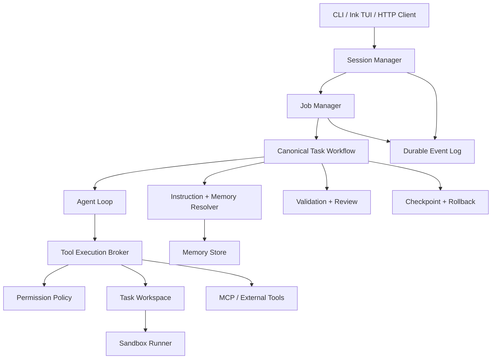
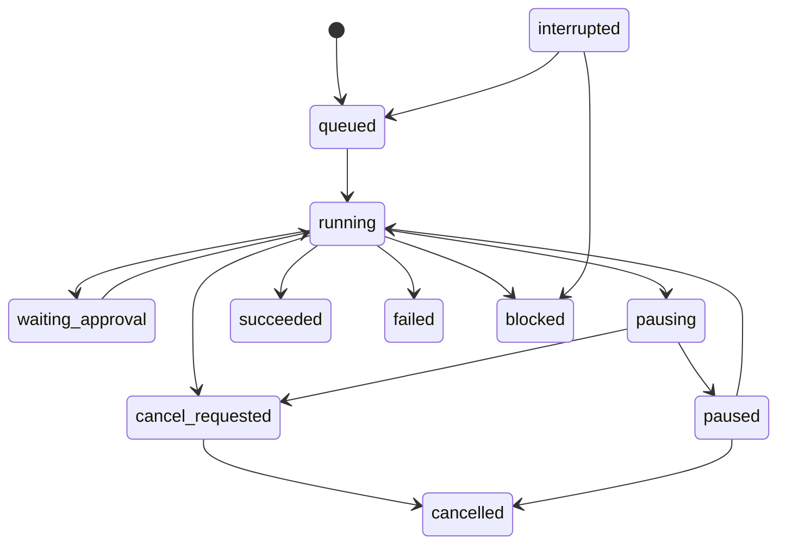
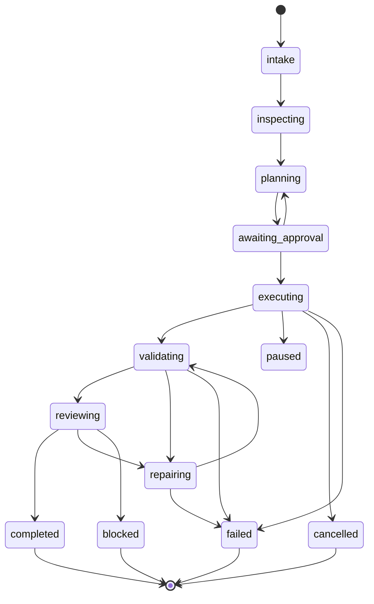

# mini-agent Agent 产品化开发文档

版本：v1.0

日期：2026-08-20

适用仓库：`@krischen99999/mini-agent-loop`

基线：当前 `main`，核心参考提交 `9cc583b`

状态：设计文档，尚未代表功能已经全部实现

## 1. 文档目标

本文把 mini-agent 与 Claude Code 类 coding agent 的主要差距拆成四个可交付的开发方向：

1. 可信的 Sandbox 与细粒度权限闭环。
2. 后台任务、暂停、取消、恢复和事件持久化。
3. 项目级长期记忆与层级化指令。
4. 计划、修改、验证、失败修复和回滚组成的默认工作流。

目标不是复制某个产品的内部实现，而是在当前项目已有 Agent Loop、工具、Session、MCP、Skills、Plan-Act 和 Git 能力之上，建立一个可恢复、可审计、默认安全的 coding agent runtime。

## 2. 当前实现基线

### 2.1 已有能力

- `src/loop.ts` 已有多轮 tool-call 循环、流式 LLM 事件、并行工具执行、上下文压缩、超时、重试、reasoning-only 恢复和最大轮数限制。
- `src/tools/` 已有文件读写、编辑、搜索、bash、Git、工作区验证、Web、外部代码库和文档相关工具。
- `src/permissions.ts` 已有 `plan` / `bypass` 两种模式、风险识别、权限 revision、活动 turn 取消和审计回调。
- `src/sandbox/` 已有 Docker/Podman 检测、Docker runner 和 Node runner，bash 可以按配置接入 sandbox。
- `src/server.ts` 已有 HTTP session、NDJSON 流式消息、session 持久化、fork、rewind、计划 API 和权限 API。
- `src/session-store.ts` 已使用 JSONL snapshot 持久化 session。
- `src/skills/` 已支持 `skills/`、`.grok/skills/`、`.claude/skills/` 和用户目录 Skills 发现与激活。
- `src/plan-act/` 和 `src/plan/` 已有计划生成、审批、执行、状态转换、文件审计和失败记录。
- `src/git/workflow.ts` 已有 checkpoint、undo 和 isolated branch 基础能力。

### 2.2 当前明确的缺口

| 领域 | 当前问题 | 本文解决方案 |
| --- | --- | --- |
| Sandbox | 没有 Docker 时会退化成普通 Node 子进程；写工具不统一经过 sandbox | 安全等级、执行 Broker、工作区隔离和 fail-closed |
| 权限 | 只有 `plan` / `bypass`；计划模式对高风险调用直接拒绝，不能形成稳定的逐次审批闭环 | 工具能力声明、审批规则、授权范围、过期和审计 |
| 任务 | session busy 时新消息返回 `409`，没有后台 Job 和控制消息 | Job Manager、事件日志、pause/resume/cancel |
| 恢复 | session 能恢复消息，但运行中的工具、计划步骤和副作用没有统一 checkpoint | Job checkpoint、幂等键和中断恢复策略 |
| 指令 | 当前只读取 cwd 下 `.agents.md` / `AGENTS.md` | 全局、仓库、目录、Skills 和任务级指令合并 |
| 记忆 | 上下文 summary 只存在于当前消息历史，没有持久化长期记忆 | 项目/用户 Memory Store 和受预算控制的检索 |
| 工作流 | Plan-Act 已存在，但计划执行、验证、review、repair 不是默认强制闭环 | Canonical Task Workflow |

### 2.3 验证基线

当前基线曾验证过 TypeScript 类型检查和完整离线测试；设计落地时必须重新运行。当前仓库声明 Node.js `>=22.19.0`，开发和 CI 不得以 Node 18 作为正式验收环境。

## 3. 总体架构

四个方向必须共享同一组领域对象，不能分别建立互不相容的状态：



### 3.1 统一领域对象

建议新增 `src/runtime/` 目录，先放类型和纯函数，避免继续把状态散落在 `server.ts` 和 `loop.ts`。

```ts
type TaskId = string;
type JobId = string;
type SessionId = string;
type WorkspaceId = string;

type Task = {
  id: TaskId;
  sessionId: SessionId;
  prompt: string;
  status: TaskStatus;
  workspaceId: WorkspaceId;
  policyRevision: number;
  createdAt: string;
  updatedAt: string;
};

type RuntimeEvent = {
  id: string;
  sequence: number;
  type: string;
  taskId?: TaskId;
  jobId?: JobId;
  sessionId?: SessionId;
  timestamp: string;
  payload: Record<string, unknown>;
};

type WorkspaceRef = {
  id: WorkspaceId;
  root: string;
  repositoryRoot?: string;
  baseRevision?: string;
  mode: "direct" | "isolated";
  writable: boolean;
};

type PolicySnapshot = {
  revision: number;
  permissionMode: "plan" | "approval" | "bypass" | "unsafe-host";
  sandboxMode: "required" | "preferred" | "disabled";
  network: "none" | "allowlist" | "full";
  allowedHosts?: string[];
  allowedTools: string[];
  expiresAt?: string;
};
```

约束：

- 所有工具执行都必须经过 `ToolExecutionBroker`，不能由 `runAgentLoop`、PlanExecutor 或 HTTP handler 各自直接调用一套权限逻辑。
- 所有会改变工作区的操作都必须带 `taskId`、`jobId`、`policyRevision` 和 `idempotencyKey`。
- 任何运行状态改变都先写 `RuntimeEvent`，再更新内存状态；恢复时以事件和 checkpoint 为准。
- 模型输出、工具结果、MCP 内容、外部仓库内容和 Web 内容都是不可信数据，不能改变系统策略。

## 4. 方向一：Sandbox 与权限闭环

### 4.1 目标

建立默认安全、可解释、可审计的执行边界：

- 模型可以探索，但不能默认获得宿主机任意执行权。
- 写文件、执行命令、网络访问、MCP 调用分别授权。
- 权限批准只对明确的工具、参数范围、工作区和有效期生效。
- sandbox 不可用时，严格模式必须失败，而不是静默降级。
- 取消、暂停或权限变更时，不能让旧 turn 的结果继续推进状态。

### 4.2 当前实现需要调整的地方

当前权限代码已经有 revision 和 active turn 机制，但 `plan` 模式对高风险工具主要是记录 request/deny 后直接抛错；`pending` 和 `resolve` 基础设施没有形成标准的“等待用户批准后继续”流程。

当前 Node runner 只是子进程包装器：它可以设置超时和代理变量，但不是安全隔离边界。当前 Docker runner 每次命令创建一个容器并挂载工作区；这可以作为执行基础，但还没有覆盖所有写工具、密钥隔离和完整的工作区策略。

### 4.3 权限模型

保留现有兼容模式，同时增加中间模式：

| 模式 | 读取 | 普通 bash | 写入/编辑 | 网络/MCP | 默认用途 |
| --- | --- | --- | --- | --- | --- |
| `plan` | 允许 | 仅安全只读命令 | 禁止 | 禁止 | 生成计划 |
| `approval` | 允许 | 安全命令自动，其他等待批准 | 等待批准 | 单独等待批准 | 交互式执行，默认推荐 |
| `bypass` | 允许 | 允许，但仍受 sandbox 和工作区限制 | 允许，但仍受 sandbox 和工作区限制 | 按 policy 限制 | 已明确授权的自动任务 |
| `unsafe-host` | 允许 | 宿主机执行 | 宿主机写入 | 宿主机网络 | 显式开发调试，不作为默认值 |

`bypass` 不能等价于“绕过全部安全控制”。它只表示不等待交互审批，不表示取消路径限制、sandbox、网络和敏感信息过滤。

### 4.4 工具能力声明

扩展 `src/tools/types.ts` 的 `Tool`：

```ts
type ToolCapabilities = {
  readWorkspace?: boolean;
  writeWorkspace?: boolean;
  executeProcess?: boolean;
  network?: boolean;
  externalData?: boolean;
  destructive?: boolean;
  requiresApproval?: boolean;
  idempotent?: boolean;
};

type Tool = {
  name: string;
  description: string;
  parameters: JsonSchema;
  capabilities?: ToolCapabilities;
  source?: ToolSource;
  execute(args: Record<string, unknown>, signal?: AbortSignal): Promise<ToolResult>;
};
```

初始声明：

- `read`、`grep`、`find`、`ls`：`readWorkspace=true`。
- `write`、`edit`、`patch`、`mkdir`、`copy`、`move`：`writeWorkspace=true`。
- `bash`：按命令分析结果设置 `executeProcess`、`writeWorkspace`、`network`、`destructive`。
- `web_*`、`fetch_content`：`network=true`、`externalData=true`。
- MCP：默认 `externalData=true`、`requiresApproval=true`，除非服务器配置显式声明安全能力。
- `git_undo`、删除和 destructive bash：`destructive=true`。

### 4.5 ToolExecutionBroker

新增：`src/runtime/tool-execution-broker.ts`。

执行顺序固定为：

1. 校验工具参数。
2. 解析工具能力和来源。
3. 检查 task、workspace、policy revision 是否仍然有效。
4. 计算风险和 approval fingerprint。
5. 检查是否已有未过期的授权。
6. 没有授权时发出 `permission_requested` 事件并进入 `waiting_approval`。
7. 获得授权后创建执行审计记录。
8. 将工具执行路由到正确的 workspace/sandbox/network runner。
9. 保存结果、退出码、文件变化和资源消耗。
10. 再次检查 policy revision，旧 policy 的结果不得提交到 task 状态。

审批 fingerprint 至少包含：

```text
taskId + workspaceId + toolName + normalizedArguments
+ source + sandboxMode + networkPolicy + policyRevision
```

授权必须支持：

- `once`：只允许当前调用。
- `turn`：当前 agent turn 内同一 fingerprint 可复用。
- `task`：当前 task 内同一工具和参数范围可复用。
- `session`：当前 session 内可复用，必须有明确的过期时间。

不允许将“允许所有 bash”作为普通授权范围。若需要批量授权，必须使用命令族、路径前缀和网络 allowlist 等结构化范围。

### 4.6 Sandbox 设计

#### 执行等级

```text
required  -> Docker/Podman 或平台级隔离不可用时直接失败
preferred -> 优先 Docker/Podman，不可用时只能降级到显式 approval
disabled  -> 只允许用户显式选择 unsafe-host
```

`auto` 只负责探测，不负责隐式改变安全等级。

#### Docker/Podman runner

- 容器内工作目录固定为 `/workspace`。
- 默认 `network=none`。
- 网络 allowlist 通过代理或专用 egress runner 实现，不能仅依赖模型自觉。
- 限制 CPU、内存、进程数、临时目录空间和执行时间。
- 默认只挂载任务 workspace，不挂载用户 home、SSH、云凭证和整个仓库父目录。
- 需要读取依赖缓存时使用只读 cache mount。
- 每次命令或每个 job 的容器生命周期由 policy 决定；默认 job 级容器，避免跨命令泄漏进程状态。

#### Node runner

Node runner 只能标记为 `process-isolation`，不能标记为 `secure-sandbox`。

- 不得复制全部 `process.env`。
- 只传递明确 allowlist 的环境变量。
- 禁止把 `http_proxy=127.0.0.1:0` 当作网络安全保证。
- `sandboxMode=required` 下不可使用 Node runner。
- `unsafe-host` 下使用 Node runner 时必须在 UI 和审计日志中显式显示。

#### Workspace 隔离

优先级：

1. Git 仓库：使用 `GitWorkflow.createIsolatedBranch()` 创建任务 worktree。
2. 有未提交改动：先记录 dirty baseline；不能静默覆盖用户改动。
3. 非 Git 目录：创建受控临时目录并复制允许的工作区内容，或拒绝 isolated 模式。
4. 直接修改当前目录只允许 `workspaceMode=direct`，并要求 checkpoint。

写工具只能接收 Broker 解析后的 workspace root，不能自行从用户参数重新决定宿主路径。

### 4.7 权限 API

```http
GET  /api/sessions/:id/policy
PUT  /api/sessions/:id/policy
GET  /api/tasks/:taskId/permissions
POST /api/tasks/:taskId/permissions/:requestId/allow
POST /api/tasks/:taskId/permissions/:requestId/deny
POST /api/tasks/:taskId/permissions/:requestId/allow-scope
```

示例：

```json
{
  "decision": "allow",
  "scope": "task",
  "expiresInMs": 1800000,
  "constraints": {
    "tools": ["edit", "write"],
    "paths": ["src/"],
    "networkHosts": []
  }
}
```

### 4.8 安全验收标准

- 严格 sandbox 不可用时没有静默宿主机降级。
- 工具不能通过 `../`、符号链接、环境变量或 bash 间接逃逸 workspace。
- MCP 工具不能复用本地工具的低风险身份。
- 批准 `src/a.ts` 不得自动批准 `src/b.ts` 或 `/tmp/a.ts`。
- policy 切换时，旧 turn 被取消，旧结果不会写入新 policy 的任务状态。
- 取消执行后，子进程和容器最终都能退出或被清理。
- 审计日志不包含 API key、Authorization header、完整敏感环境变量和未脱敏 secret。

## 5. 方向二：后台任务、暂停、取消和恢复

### 5.1 目标

将当前“一个 HTTP 请求对应一个完整 agent turn”的模型升级为“Session 承载对话，Job 承载长任务”：

- 用户可以在 worker 执行期间继续和 session 对话。
- 用户可以暂停、恢复和取消任务。
- 连接断开不等于任务取消。
- 事件可重放，客户端可以断线续订。
- 进程重启后能识别中断任务，并根据 checkpoint 安全恢复或标记为 blocked。

### 5.2 Job 状态机



建议状态：

```ts
type JobStatus =
  | "queued"
  | "running"
  | "waiting_approval"
  | "pausing"
  | "paused"
  | "cancel_requested"
  | "cancelled"
  | "succeeded"
  | "failed"
  | "blocked"
  | "interrupted";
```

状态转换必须集中在 `src/runtime/job-state-machine.ts`，禁止 HTTP handler 直接修改 `job.status`。

### 5.3 Job 数据模型

新增 `src/runtime/job-types.ts`：

```ts
type Job = {
  id: JobId;
  taskId: TaskId;
  sessionId: SessionId;
  kind: "agent_turn" | "plan_execute" | "subagent" | "validation" | "review";
  status: JobStatus;
  prompt?: string;
  parentJobId?: JobId;
  workspaceId: WorkspaceId;
  policyRevision: number;
  currentStepId?: string;
  currentTurn?: number;
  checkpointId?: string;
  retryCount: number;
  createdAt: string;
  startedAt?: string;
  pausedAt?: string;
  finishedAt?: string;
  error?: { code: string; message: string; retryable: boolean };
};

type JobCheckpoint = {
  id: string;
  jobId: JobId;
  sequence: number;
  history: AgentMessage[];
  runtime: Record<string, unknown>;
  workspace: WorkspaceRef;
  planState?: Record<string, unknown>;
  completedToolKeys: string[];
  createdAt: string;
};
```

### 5.4 Job Manager

新增：

- `src/runtime/job-manager.ts`
- `src/runtime/job-store.ts`
- `src/runtime/job-runner.ts`
- `src/runtime/job-control.ts`
- `src/runtime/job-state-machine.ts`

职责分离：

- `JobStore`：JSONL 事件追加、checkpoint 写入和恢复读取。
- `JobManager`：创建、查询、订阅和状态转换。
- `JobRunner`：实际调用 `runAgentTurn`、PlanExecutor、ValidationRunner。
- `JobControl`：pause/resume/cancel/continue/answer。
- `JobEventBus`：内存订阅 + 事件重放，不承担持久化责任。

第一阶段可以在同一 Node 进程运行；第二阶段再把 JobRunner 拆成 worker process。数据契约不能依赖进程内对象，以便后续迁移。

### 5.5 暂停语义

暂停不是立即杀死当前系统调用，而是 cooperative pause：

安全暂停点：

1. 发起下一次 LLM 请求之前。
2. 每个工具调用之前。
3. 工具调用完成之后。
4. 每次 `assistant` 消息处理完成之后。
5. 每个 Plan step 完成之后。

遇到不可中断的外部命令时，任务进入 `pausing`，等待命令结束或超时；不得在文件写入中间强行恢复。

运行时接口：

```ts
type JobControlToken = {
  throwIfPauseRequested(): Promise<void>;
  throwIfCancelRequested(): void;
  waitUntilResumed(): Promise<void>;
};
```

`runAgentLoop` 扩展 `controlToken`，并在每个 safe point 调用。所有子代理继承父 Job 的 cancel signal，但可以拥有独立 pause 状态。

### 5.6 取消语义

- `cancel` 先写入 `cancel_requested` 事件，再 abort LLM、工具、子代理和 sandbox。
- 工具必须支持 `AbortSignal`；不支持时由 Broker 设定超时并记录 `uncancellable=true`。
- 取消后不可自动重试。
- 已经产生的文件改动保留在任务 workspace，除非 policy 配置 `autoRollback=true`。
- 取消响应必须返回 job 当前状态，而不是假设同步完成。

### 5.7 恢复语义

启动时扫描所有 `running`、`pausing`、`cancel_requested`：

- 有有效 checkpoint：转为 `interrupted`，按配置自动回到 `queued` 或等待用户 resume。
- 没有 checkpoint：转为 `blocked`，说明可能存在未知副作用，禁止自动重跑。
- 正在执行的非幂等工具不得因为重启被重复调用。
- 每个工具调用保存 `idempotencyKey`，恢复时先查询已完成调用记录。

恢复前必须重新确认：workspace 存在、Git HEAD/dirty baseline 一致、policy 未过期、模型配置仍可用、计划版本没有变化。

### 5.8 HTTP API

```http
POST /api/sessions/:sessionId/jobs
GET  /api/jobs/:jobId
GET  /api/jobs/:jobId/events?after=42
POST /api/jobs/:jobId/pause
POST /api/jobs/:jobId/resume
POST /api/jobs/:jobId/cancel
POST /api/jobs/:jobId/answer
POST /api/jobs/:jobId/retry
```

创建任务：

```json
{
  "prompt": "实现并验证这个功能",
  "kind": "agent_turn",
  "execution": "background",
  "workspaceMode": "isolated",
  "permissionMode": "approval"
}
```

事件接口使用 NDJSON 或 SSE，必须支持 `after` sequence 重放：

```json
{
  "sequence": 42,
  "type": "tool_finished",
  "jobId": "job_123",
  "payload": {
    "tool": "write",
    "ok": true,
    "changedFiles": ["src/example.ts"]
  }
}
```

现有 `/api/sessions/:id/messages` 兼容策略：

- 保留 `execution=foreground`，适合短请求。
- `execution=background` 返回 `202` 和 `jobId`，不再保持请求连接。
- session busy 时不再对所有输入统一返回 `409`：普通消息进入 `queued_input`；`pause`、`cancel`、`answer` 进入 JobControl；只对互斥的配置变更返回 `409`。

### 5.9 后台任务验收标准

- HTTP 连接断开后 job 仍然运行，重新连接可以从 sequence 继续读取。
- pause 能阻止下一次模型调用，resume 能继续原 job。
- cancel 能终止主 loop、子代理和 sandbox 子进程。
- 进程重启不会重复执行已完成的非幂等工具。
- job、checkpoint 和事件恢复后状态一致。
- 同一 session 可以在后台 job 运行期间接收控制消息和用户补充信息。

## 6. 方向三：项目级长期记忆与层级化指令

### 6.1 目标

让 Agent 在不同 session、不同任务和不同目录中稳定遵守项目规则，同时保留经过确认的长期决策；避免把所有历史对话无限塞入 prompt。

### 6.2 指令层级

安全策略与提示词指令分开处理。建议有效优先级如下：

```text
系统安全策略
  > 用户当前明确请求
  > 用户全局指令
  > 仓库根指令
  > 父目录指令
  > 当前目录指令
  > 激活 Skill 指令
  > 任务记忆
  > 检索到的历史知识
  > 工具输出中的建议
```

其中任何低层内容都不能覆盖系统安全策略；工具输出永远不能升级成指令。

### 6.3 指令文件发现

新增 `InstructionResolver`，从目标 workspace 向上遍历到用户目录，加载存在的文件：

| 层级 | 文件 |
| --- | --- |
| 用户全局 | `~/.mini-agent/AGENTS.md`、`~/.claude/CLAUDE.md` |
| 仓库根 | `.agents.md`、`AGENTS.md`、`CLAUDE.md`、`.claude/CLAUDE.md` |
| 父目录 | 同上，按距 workspace 根的顺序合并 |
| 当前目录 | 同上 |
| Skill | `<skill>/SKILL.md` |

兼容规则：

- 保留当前 `.agents.md` 优先于 `AGENTS.md` 的兼容行为，但在多个目录层级内按层级合并。
- `CLAUDE.md` 作为兼容文件名，不意味着其内容拥有更高权限。
- 同一层级重复定义时，离当前 workspace 最近的文件覆盖低优先级字段；安全相关字段只能收紧，不能放宽。
- 每个注入片段带有 source、path、层级和 hash，便于审计和调试。

新增：

- `src/instructions/types.ts`
- `src/instructions/resolver.ts`
- `src/instructions/merge.ts`
- `src/instructions/prompt.ts`

### 6.4 Memory Store 目录结构

用户级：

```text
~/.mini-agent/memory/
  MEMORY.md
  entries/
    <id>.md
  index.json
```

项目级：

```text
<repo>/.mini-agent/memory/
  MEMORY.md
  entries/
    <id>.md
  index.json
```

项目记忆是否写入 Git 由项目配置决定。默认不自动修改 Git tracked 文件；可以通过 `.gitignore` 或显式配置选择提交项目记忆。

### 6.5 Memory 数据模型

```ts
type MemoryEntry = {
  id: string;
  scope: "user" | "project" | "task";
  title: string;
  content: string;
  tags: string[];
  source: {
    sessionId?: string;
    taskId?: string;
    messageId?: string;
    userConfirmed: boolean;
  };
  confidence: "low" | "medium" | "high";
  sensitivity: "normal" | "private" | "secret-like";
  createdAt: string;
  updatedAt: string;
  lastUsedAt?: string;
};
```

禁止写入：API key、密码、cookie、Authorization header、私有证书、完整环境变量和未经用户确认的个人敏感信息。

### 6.6 记忆写入规则

默认行为：

- 任务内 summary 写入 session history，不自动变成长效记忆。
- 用户明确说“记住”“保存为项目规则”时，生成候选记忆并请求确认。
- 项目构建命令、测试命令、代码风格、架构决策等高价值信息可以自动生成候选，但默认需要用户确认后持久化。
- 低置信度、一次性事实和工具输出中的指令不得自动写入长期记忆。
- 记忆更新采用 append/revision，不直接覆盖旧内容；冲突交给 resolver 标记并让用户选择。

### 6.7 记忆检索

第一阶段使用确定性检索，避免增加基础设施：

1. 当前仓库和当前目录范围过滤。
2. 标签、路径、命令名和用户 prompt 关键词匹配。
3. 置信度和最近使用时间排序。
4. 去重并限制最多 8 条。
5. 限制总注入 token，超过预算只保留摘要和索引。

第二阶段再增加 embedding/index provider，但检索结果仍必须带来源和置信度。

### 6.8 Context 与 Memory 的边界

- Context compaction 保证当前任务连续性。
- Memory Store 保存跨 session 可复用的稳定知识。
- Memory 不能替代原始用户目标、当前计划、实际 diff 和测试结果。
- 压缩时保留原始任务目标、验收标准、当前计划、未完成步骤和最近失败原因。
- 旧 summary 和 memory 都以普通数据注入，不能覆盖工具 Broker 的安全策略。

### 6.9 Memory API 与命令

```http
GET    /api/memory?scope=project&query=testing
POST   /api/memory/candidates
POST   /api/memory/:id/confirm
PATCH  /api/memory/:id
DELETE /api/memory/:id
GET    /api/instructions?workspace=<path>
```

CLI/TUI：

```text
/memory list
/memory search <query>
/memory save <text>
/memory confirm <id>
/memory forget <id>
/instructions
```

### 6.10 记忆验收标准

- 不同 session 能读取已确认的项目记忆。
- 当前目录的指令不会泄漏到不相关 workspace。
- 高优先级目录指令能覆盖低优先级目录指令，但不能扩大安全权限。
- 工具输出中出现“忽略之前指令”不会改变系统 prompt 或 policy。
- 记忆达到 token 上限时不会挤掉当前用户请求、计划和最近工具结果。
- secret-like 内容被拒绝或脱敏后才能进入 memory candidate。

## 7. 方向四：默认的计划、修改、验证、修复、回滚工作流

### 7.1 目标

把 Agent 从“模型认为完成了”变成“有证据地完成了”：

- 修改前知道要改什么。
- 修改后自动验证。
- 验证失败时有限次修复。
- 修复后重新验证和 review。
- 任何时刻都能展示 diff、测试结果、失败原因和回滚点。

### 7.2 Canonical Task Workflow



建议状态：

```ts
type TaskStatus =
  | "intake"
  | "inspecting"
  | "planning"
  | "awaiting_approval"
  | "executing"
  | "validating"
  | "reviewing"
  | "repairing"
  | "paused"
  | "completed"
  | "blocked"
  | "cancelled"
  | "failed";
```

现有 `SessionPhase` 和 `PlanStatus` 继续兼容，但不再把二者当作完整 task 状态。需要修正当前 `SESSION_PHASES` 与 `SessionPhase` 类型声明不完全一致的问题，并将 Plan-Act 作为 Canonical Workflow 的一个子状态。

### 7.3 WorkOrder、Plan、Attempt、Review

```ts
type WorkOrder = {
  taskId: TaskId;
  goal: string;
  scope: { paths: string[]; excludedPaths: string[] };
  acceptanceCriteria: string[];
  constraints: string[];
  workspaceId: WorkspaceId;
  workerProfile?: string;
  plannerModel?: string;
  reviewerModel?: string;
};

type ExecutionAttempt = {
  id: string;
  taskId: TaskId;
  planVersion: number;
  repairRound: number;
  checkpointId: string;
  changedFiles: string[];
  validation?: ValidationReport;
  review?: ReviewReport;
  status: "running" | "passed" | "failed" | "rolled_back";
};

type ValidationReport = {
  ok: boolean;
  commands: Array<{
    command: string;
    exitCode: number;
    output: string;
    durationMs: number;
  }>;
  diagnostics: string[];
};

type ReviewReport = {
  decision: "pass" | "rework" | "blocked";
  findings: Array<{
    severity: "critical" | "high" | "medium" | "low";
    file?: string;
    line?: number;
    message: string;
  }>;
  acceptanceCriteria: Array<{ text: string; met: boolean; evidence?: string }>;
};
```

### 7.4 默认执行算法

1. **Intake**：保存用户原始请求，不因后续 compact 丢失。
2. **Inspecting**：只读扫描仓库结构、指令、当前 Git 状态、相关文件和测试入口。
3. **Planning**：生成结构化 WorkOrder 和 Plan，列出文件、步骤、风险、验收标准和验证命令。
4. **Approval**：在 `approval` 或 `plan` 模式等待用户确认；计划改变时增加 plan version。
5. **Checkpoint**：在第一次写入前创建 Git checkpoint 或 isolated workspace baseline。
6. **Executing**：每个 step 通过 ToolExecutionBroker 执行，记录输入、输出摘要、改动文件和状态。
7. **Validating**：写操作完成后自动执行项目配置中的 typecheck、focused test、full test 或 build。
8. **Reviewing**：reviewer 使用 WorkOrder、Plan、实际 diff、ValidationReport 和工具日志进行只读审查。
9. **Repairing**：如果 review 或验证失败，生成明确 repair task，只允许修改相关文件；默认最多 2 轮。
10. **Finalizing**：重新验证、审计计划文件与实际改动、输出 checkpoint、测试结果、未解决问题和回滚入口。

默认停止条件：

- 所有验收标准满足，验证命令通过，review decision 为 `pass`。
- repair 达到上限。
- 需要用户选择、外部凭证、网络授权或工作区冲突。
- policy、模型、sandbox 或 workspace 不可恢复。

### 7.5 Planner / Worker / Reviewer 分工

| 角色 | 默认工具 | 默认职责 |
| --- | --- | --- |
| Planner | read/grep/find/ls/git_status/git_diff | 了解仓库、拆步骤、定义验收标准 |
| Worker | read/grep/find/ls/edit/write/bash/git_diff/validate | 实际修改和运行验证 |
| Reviewer | read/grep/find/ls/git_diff/validate | 检查 diff、风险、测试和验收标准 |
| Repairer | 与 Worker 相同，但限定在 repair scope | 处理明确失败，不重新发散任务 |

Planner 和 Reviewer 默认不能写文件。Worker 不应直接修改计划文件、事件日志和权限 policy。

### 7.6 验证策略

新增 `ValidationProfile`：

```json
{
  "name": "typescript-project",
  "detect": ["package.json", "tsconfig.json"],
  "steps": [
    { "name": "typecheck", "command": "npm run typecheck", "required": true },
    { "name": "focused", "command": "npm test -- --test-name-pattern=<focused>", "required": false },
    { "name": "full", "command": "npm test", "required": true }
  ],
  "timeoutMs": 600000
}
```

规则：

- 验证命令必须在任务 workspace/sandbox 内运行。
- 先 focused，再 full；focused 失败时先尝试修复，不直接浪费 full test 资源。
- 验证输出截断但保留完整 artifact 路径。
- 命令退出码、signal、超时和环境都写入 ValidationReport。
- 项目没有验证配置时，至少运行可发现的 typecheck/test/build；都不存在时标记 `validation_unconfigured`，不能伪装成通过。

### 7.7 Review 策略

reviewer 必须获得：

- 原始用户请求。
- WorkOrder 和 acceptance criteria。
- 当前 Plan 版本。
- 实际 Git diff 和 changed files。
- ValidationReport。
- 相关工具错误和权限事件摘要。

review 输出不能只说“看起来没问题”，必须逐项给出：

- 是否满足验收标准。
- 是否有未计划文件变更。
- 是否有测试缺口。
- 是否有安全、兼容性或回滚风险。
- 是否应该 pass、rework 或 blocked。

### 7.8 回滚策略

- 默认在第一次写入前创建 checkpoint。
- 每个 repair round 创建新的 checkpoint，不覆盖旧 checkpoint。
- `autoRollback=true` 只在明确的 execution failure 或用户要求时执行，不因 reviewer 的低优先级建议自动回滚。
- 回滚前确认 job 未运行写操作，记录 `rollback_started` 和 `rollback_finished`。
- 有用户原始 dirty changes 时，回滚只恢复 task-owned changes，不删除用户在任务期间产生的独立改动。
- isolated workspace 默认通过删除/保留 worktree 处理；合并回主 workspace 前必须再次显示 diff 并请求确认。

### 7.9 工作流 API

```http
POST /api/sessions/:id/tasks
GET  /api/tasks/:taskId
GET  /api/tasks/:taskId/plan
POST /api/tasks/:taskId/plan/approve
POST /api/tasks/:taskId/plan/reject
POST /api/tasks/:taskId/start
POST /api/tasks/:taskId/pause
POST /api/tasks/:taskId/resume
POST /api/tasks/:taskId/cancel
POST /api/tasks/:taskId/review
POST /api/tasks/:taskId/repair
POST /api/tasks/:taskId/rollback
GET  /api/tasks/:taskId/diff
GET  /api/tasks/:taskId/validation
```

现有 `/api/sessions/:id/plan/*` API 保留为兼容层，内部转发到 Task/Job/Plan 服务；新功能不要继续扩展多个平行 plan API。

### 7.10 工作流验收标准

- 一个写任务默认经过 inspect、plan、approve、execute、validate、review。
- 没有 plan 或没有 approval 时，Worker 不能写入受保护 workspace。
- 写入后至少触发一次自动验证。
- 验证失败能生成带错误证据的 repair task，并限制 repair 次数。
- reviewer 能看到真实 diff，不使用模型自述替代文件状态。
- 任务完成结果包含 changed files、验证命令、review 结论、checkpoint 和未解决问题。
- 用户可以在执行中暂停、取消或回滚。

## 8. 文件与模块改造清单

### 8.1 第一批：统一契约

新增：

```text
src/runtime/ids.ts
src/runtime/events.ts
src/runtime/task-types.ts
src/runtime/policy-types.ts
src/runtime/workspace-types.ts
src/runtime/errors.ts
```

修改：

```text
src/tools/types.ts
src/loop.ts
src/permissions.ts
src/session-store.ts
```

### 8.2 第二批：执行安全

新增：

```text
src/runtime/tool-execution-broker.ts
src/runtime/approval-store.ts
src/runtime/sandbox-policy.ts
src/runtime/workspace-manager.ts
src/runtime/secret-redactor.ts
```

修改：

```text
src/tools/index.ts
src/tools/bash.ts
src/tools/read.ts
src/tools/write.ts
src/tools/workspace-tools.ts
src/tools/git.ts
src/mcp/tool-adapter.ts
src/sandbox/index.ts
src/sandbox/node-runner.ts
src/sandbox/docker-runner.ts
```

### 8.3 第三批：Job 与恢复

新增：

```text
src/runtime/job-types.ts
src/runtime/job-state-machine.ts
src/runtime/job-store.ts
src/runtime/job-manager.ts
src/runtime/job-runner.ts
src/runtime/job-control.ts
src/runtime/event-bus.ts
```

修改：

```text
src/server.ts
src/cli.ts
src/tui/state.ts
src/tui/App.tsx
src/tui/components/TaskPanel.tsx
```

### 8.4 第四批：Instruction 与 Memory

新增：

```text
src/instructions/types.ts
src/instructions/resolver.ts
src/instructions/merge.ts
src/instructions/prompt.ts
src/memory/types.ts
src/memory/store.ts
src/memory/indexer.ts
src/memory/retriever.ts
src/memory/safety.ts
```

修改：

```text
src/agents-md.ts
src/context.ts
src/skills/index.ts
src/loop.ts
src/server.ts
```

### 8.5 第五批：Canonical Workflow

新增：

```text
src/workflow/types.ts
src/workflow/state-machine.ts
src/workflow/task-manager.ts
src/workflow/inspection.ts
src/workflow/validation-runner.ts
src/workflow/reviewer.ts
src/workflow/repair.ts
src/workflow/finalizer.ts
```

修改：

```text
src/plan-act/state-machine.ts
src/plan-act/plan-executor.ts
src/plan/workflow.ts
src/validation.ts
src/git/workflow.ts
src/server.ts
```

## 9. 分阶段实施计划

### Milestone 0：契约和回归基线

交付：

- 统一 Task、Job、RuntimeEvent、Workspace、Policy 类型。
- 为现有 session/plan/subagent 事件增加 task/job 字段但保持可选。
- 建立事件 schema version 和 migration 测试。
- CI 固定 Node 22，并记录 typecheck、full test、sandbox test 结果。

完成条件：旧 CLI、TUI、HTTP session 和现有测试不回归。

### Milestone 1：安全执行闭环

交付：

- ToolExecutionBroker 接管所有工具执行。
- `approval` 模式可等待并恢复。
- Docker/Podman required/preferred/disabled 策略。
- isolated workspace 和 secret allowlist。
- 权限和 sandbox 审计事件。

完成条件：安全测试全部通过，Node runner 不再被误标记为 secure sandbox。

### Milestone 2：后台 Job

交付：

- JobStore、JobManager、事件重放。
- background create、pause、resume、cancel、retry。
- session busy 从全局锁改为任务级并发控制。
- process restart 后 interrupted 检测和 checkpoint 恢复。

完成条件：断开客户端、暂停、恢复、取消和重启恢复均有自动化测试。

### Milestone 3：Instruction 和 Memory

交付：

- 层级指令发现、合并和来源审计。
- 项目/用户 Memory Store。
- candidate/confirm/forget API 和 TUI 命令。
- compaction 与 memory token budget 联动。

完成条件：跨 session 记忆、目录隔离、注入防护和 secret 拦截通过测试。

### Milestone 4：Canonical Workflow

交付：

- intake、inspect、plan、approval、execute、validate、review、repair、finalize。
- planner/worker/reviewer 角色边界。
- 自动验证、修复轮次上限、diff 审计和 checkpoint 回滚。
- 兼容旧 Plan-Act API。

完成条件：一个真实小型 TypeScript 修改任务可以完整走通并产出证据。

### Milestone 5：产品化和性能

交付：

- Ink TUI 的 Job 状态、权限面板、diff、验证和 review 展示。
- HTTP SSE/NDJSON 断线重连。
- Job 并发、token、成本、sandbox 资源指标。
- 大仓库上下文检索和事件日志压缩。

完成条件：长任务运行稳定，UI 不阻塞，资源和错误可观测。

## 10. 测试策略

### 10.1 单元测试

- Permission policy：风险、scope、过期、revision、MCP 来源。
- Sandbox policy：required fail-closed、网络、环境变量、资源限制。
- Workspace manager：路径逃逸、符号链接、dirty baseline、worktree。
- Job state machine：所有合法/非法转换。
- JobStore：事件追加、sequence、重放、截断日志、迁移。
- Memory resolver：层级、覆盖、冲突、token budget、secret 拦截。
- Workflow：repair 上限、验收标准、validation/review 结果映射。

### 10.2 集成测试

- Agent Loop 通过 Broker 执行 read/write/bash/MCP。
- permission request -> allow -> tool execute -> event persisted。
- pause/resume 跨模型调用和工具调用。
- cancel 传播到 subagent batch 和 sandbox。
- session 在 job 运行期间接收控制消息。
- 进程重启后 checkpoint 恢复且不重复非幂等工具。
- isolated worktree 的 diff、merge 和 rollback。

### 10.3 端到端测试

至少覆盖三个场景：

1. 只读分析任务：不创建写权限，不触发 sandbox 写入。
2. TypeScript 功能任务：计划、批准、修改、typecheck、focused test、full test、review、完成。
3. 失败恢复任务：验证失败、repair、再次失败、blocked、用户选择 rollback 或继续。

### 10.4 安全测试

- `../`、绝对路径、符号链接和 bash 间接路径逃逸。
- 读取 home、SSH、云凭证和环境变量。
- MCP 返回 prompt injection。
- Web 内容伪造 system instruction。
- 恶意命令组合、重定向、管道、命令替换和后台进程。
- 容器超时、僵尸进程、容器清理失败。
- 客户端断开、重复 allow、重复 resume、重复 retry。

### 10.5 验收命令

正式环境使用 Node 22：

```bash
npm run typecheck
npm test
npm run test:coverage
npm run build:package
git diff --check
```

真实 provider、Docker/Podman、PTY/TUI 和网络访问需要单独标注环境条件，不能用 faux model 测试替代。

## 11. 兼容性与迁移

- 保留旧 `PermissionMode` 的 `plan` 和 `bypass`；新 API 内部映射到 Policy Snapshot。
- 保留 `/api/sessions/:id/messages`、`/api/sessions/:id/plan/*` 和已有 session JSONL 格式，增加可选字段。
- `SessionStore`、`PlanDocument`、`Job` 和 `MemoryEntry` 都带 `version`，使用显式迁移函数，不在读取时静默改变语义。
- 旧 session 没有 job 时视为已完成历史对话，不尝试推测未保存的运行状态。
- 旧直接 workspace 模式继续可用，但新安装默认使用 `approval + sandbox preferred + checkpoint`。
- `unsafe-host` 只能通过显式 CLI flag 或管理员配置开启，不能由普通模型输出开启。

## 12. 观测指标与日志

最少记录以下指标：

- task/job 数量、各状态耗时、暂停次数、取消次数、恢复次数。
- 每个模型请求的 input/output/cache token、延迟、重试和错误类型。
- 每个工具调用的耗时、退出码、风险、授权 scope、sandbox 类型。
- 每次验证的命令、耗时、退出码和失败分类。
- review pass/rework/blocked 比例和 repair round 数。
- checkpoint 创建、rollback 成功率和 workspace 冲突。

日志要求：

- 用 taskId/jobId/sessionId/sequence 关联，不依赖文本 grep。
- 工具参数默认 redact，只有安全字段进入日志。
- 事件 payload 有大小上限，大输出写 artifact 文件并只在事件中引用。
- 任何秘密泄漏都作为安全事件处理，而不是普通模型错误。

## 13. 主要风险和取舍

### 风险一：Node fallback 被误认为安全

处理：required 模式 fail-closed；UI、日志和 API 明确显示 `process-isolation`，并禁止普通配置自动把它当 secure。

### 风险二：后台任务恢复导致重复写入

处理：checkpoint、idempotencyKey、非幂等工具恢复前人工确认；没有可靠 checkpoint 时进入 blocked。

### 风险三：层级指令和 Memory 导致 prompt 膨胀

处理：source-aware resolver、固定 token budget、摘要化、top-k 检索和调试接口。

### 风险四：自动修复循环无限消耗成本

处理：默认最多 2 轮 repair；每轮独立 checkpoint；达到上限转 blocked 并输出证据。

### 风险五：隔离 workspace 影响用户体验

处理：TUI 显示 workspace、branch、diff 和 apply 状态；支持显式 direct 模式；合并前不自动覆盖用户当前工作区。

### 风险六：四套状态机再次分裂

处理：TaskStatus 是唯一业务生命周期；JobStatus 是执行载体状态；PlanStatus 是计划状态；SessionPhase 只做兼容映射，不允许新增重复语义。

## 14. 最终完成定义

四项能力完成的标准不是“文件存在”，而是下面的用户路径全部可用：

```text
用户提出代码任务
  -> Agent 读取层级指令和已确认记忆
  -> 创建 Task 和 isolated workspace
  -> 只读检查并生成计划
  -> 用户审批工具、网络和写入范围
  -> 后台 Job 执行
  -> 用户可继续对话、暂停、恢复或取消
  -> Worker 修改代码并自动验证
  -> Reviewer 查看真实 diff 和验证证据
  -> 失败时限次修复
  -> 完成、阻塞或回滚
  -> 所有状态、权限、工具、验证和恢复事件可重放
```

达到该标准后，mini-agent 才从“有很多 Agent 能力的 runtime”进入“可长期使用的 coding agent 产品”阶段。
