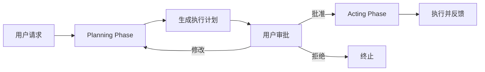
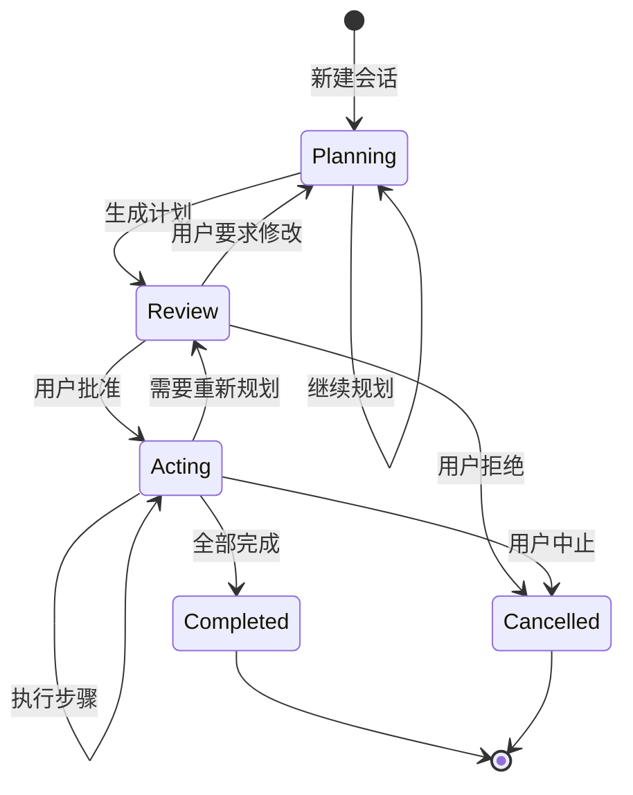
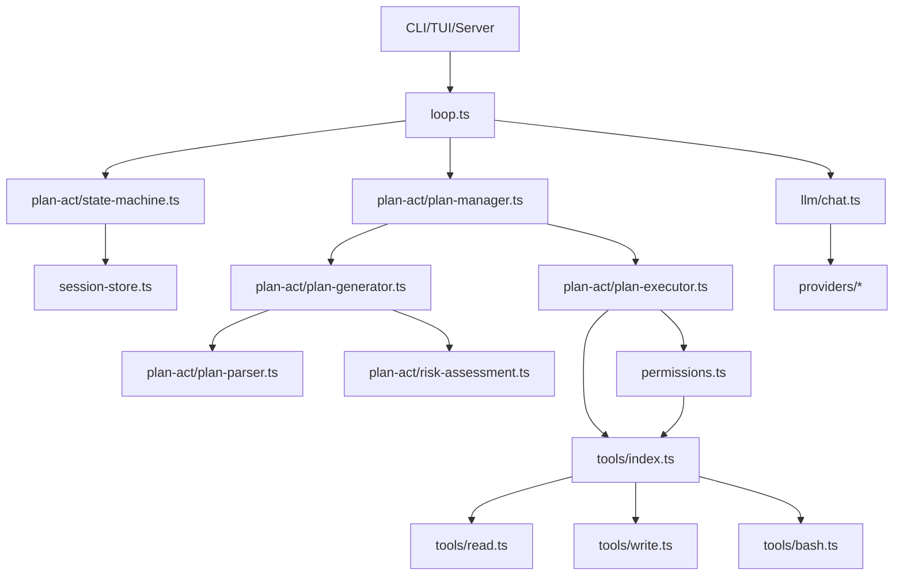

# 权限系统 Plan-Act 架构改造方案

## 一、背景与目标

### 当前架构分析

当前系统使用四种权限模式：

| 模式 | 说明 | 执行能力 | 审批要求 |
|------|------|----------|----------|
| **plan** | 仅分析规划 | 只读工具（危险操作硬拒绝） | 无审批路径 |
| **manual** | 完全手动控制 | 所有工具 | 每个工具都需审批 |
| **auto** | 智能自动化 | 所有工具 | 仅风险操作需审批 |
| **bypass** | 无限制执行 | 所有工具 | 无需审批 |

**核心问题：**
- 模式切换不直观，用户需要手动理解四种模式的区别
- "plan" 模式虽然限制执行，但缺乏显式的"规划输出 → 审批 → 执行"工作流
- 缺少中间状态来保存和展示计划内容
- 审批粒度混乱：既有工具级别的审批（manual/auto），又有模式级别的限制（plan）

### 改造目标

设计一个 **两阶段工作流架构**：



**核心改进：**
1. 显式的两阶段流程：Planning → Review → Acting
2. 结构化的计划表示（可序列化、可审查、可修改）
3. 计划与执行的状态分离
4. 保留灵活的执行权限控制（manual/auto/bypass 在 Acting 阶段使用）

---

## 二、架构设计

### 2.1 概念模型

#### Phase（阶段）
会话可处于以下阶段之一：

```typescript
type SessionPhase = 
  | "planning"   // 规划阶段：生成执行计划
  | "review"     // 审查阶段：等待用户批准计划
  | "acting"     // 执行阶段：执行已批准的计划
  | "completed"  // 已完成
  | "cancelled"; // 已取消
```

#### ExecutionPlan（执行计划）
结构化的执行计划对象：

```typescript
interface ExecutionPlan {
  id: string;
  sessionId: string;
  createdAt: number;
  
  // 计划内容
  summary: string;              // 计划摘要
  steps: ExecutionStep[];       // 执行步骤
  risks: RiskAssessment[];      // 风险评估
  requiredTools: string[];      // 需要的工具
  
  // 状态
  status: "draft" | "pending_review" | "approved" | "rejected" | "modified";
  reviewedAt?: number;
  reviewNotes?: string;
  
  // 执行控制
  executionMode?: "manual" | "auto" | "bypass";  // 执行时的权限模式
  allowedOperations?: string[];  // 白名单操作（可选）
}

interface ExecutionStep {
  id: string;
  order: number;
  description: string;
  tool: string;
  arguments: Record<string, unknown>;
  risk: "safe" | "medium" | "high";
  rationale: string;  // 为什么需要这一步
  
  // 执行状态（Acting 阶段填充）
  status?: "pending" | "running" | "completed" | "failed" | "skipped";
  result?: ToolResult;
  executedAt?: number;
}

interface RiskAssessment {
  category: "file_modification" | "command_execution" | "network_access" | "mcp_tool";
  level: "low" | "medium" | "high" | "critical";
  description: string;
  mitigation: string;
}
```

### 2.2 状态机设计



#### 状态转换规则

| 当前阶段 | 触发事件 | 目标阶段 | 条件 |
|---------|---------|---------|------|
| planning | `generate_plan` | review | 计划生成完成 |
| planning | `continue_planning` | planning | 需要更多信息 |
| review | `approve_plan` | acting | 用户批准 |
| review | `reject_plan` | cancelled | 用户拒绝 |
| review | `modify_plan` | planning | 用户要求修改 |
| acting | `step_completed` | acting | 还有待执行步骤 |
| acting | `all_completed` | completed | 所有步骤完成 |
| acting | `replan` | review | 执行中发现需要调整 |
| acting | `cancel` | cancelled | 用户或系统中止 |

### 2.3 权限控制分层

**Planning 阶段的权限：**
- 硬编码为 `plan` 模式
- 只允许只读操作（read, grep, find, ls, git_status, git_diff, codebase_search 等）
- 所有写操作和危险命令硬拒绝
- MCP 工具硬拒绝

**Acting 阶段的权限：**
- 使用计划中指定的 `executionMode`（manual/auto/bypass）
- 继承现有的 [`PermissionManager`](src/permissions.ts:385) 逻辑
- 可选：使用计划中的 `allowedOperations` 白名单进一步限制

---

## 三、数据结构变更

### 3.1 Session 扩展

```typescript
// src/session-store.ts 和 src/server.ts 中的 Session 类型
interface Session {
  id: string;
  createdAt: number;
  messages: AgentMessage[];
  
  // 新增字段
  phase: SessionPhase;
  currentPlan?: ExecutionPlan;
  planHistory: ExecutionPlan[];  // 历史计划记录
  
  // 现有字段保持
  permissionManager: PermissionManager;
  thinkingMode?: ThinkingMode;
  // ...
}
```

### 3.2 新增事件类型

```typescript
// src/loop.ts 中的 TurnEvent
type TurnEvent = 
  | { type: "planning_started" }
  | { type: "plan_generated"; plan: ExecutionPlan }
  | { type: "plan_approved"; planId: string }
  | { type: "plan_rejected"; planId: string; reason?: string }
  | { type: "acting_started"; planId: string }
  | { type: "step_started"; stepId: string; step: ExecutionStep }
  | { type: "step_completed"; stepId: string; result: ToolResult }
  | { type: "step_failed"; stepId: string; error: string }
  | { type: "all_steps_completed" }
  // ... 现有事件保持
```

### 3.3 System Prompt 调整

需要在 [`buildSystemPrompt`](src/loop.ts:264) 中添加阶段感知：

```typescript
const PHASE_SUFFIX: Record<SessionPhase, string> = {
  planning: `
**当前阶段：规划阶段 (Planning Phase)**

你的任务是分析用户需求并生成详细的执行计划，而不是直接执行操作。

规划要求：
1. 理解用户意图和目标
2. 使用只读工具收集必要信息（read, grep, find, ls, codebase_search 等）
3. 生成结构化的执行计划，包含：
   - 计划摘要
   - 详细的执行步骤（每步说明工具、参数、原因）
   - 风险评估
   - 所需工具列表
4. 输出计划后，等待用户批准

注意：你当前无权执行写操作、危险命令或 MCP 工具，这些会被硬拒绝。
`,
  
  review: `
**当前阶段：审查阶段 (Review Phase)**

计划已生成，等待用户审批。你可以：
- 回答用户对计划的疑问
- 根据用户反馈修改计划
- 如果用户批准，系统会自动切换到执行阶段
`,
  
  acting: `
**当前阶段：执行阶段 (Acting Phase)**

你正在执行已批准的计划。请按照计划的步骤顺序执行：
1. 严格按照计划执行每一步
2. 每步执行后报告结果
3. 如果遇到意外情况，说明问题并建议是否需要重新规划
4. 完成所有步骤后总结成果

当前执行模式：{executionMode}
`,
  
  completed: `任务已完成。`,
  cancelled: `任务已取消。`,
};
```

---

## 四、API 设计

### 4.1 新增 REST API

```typescript
// 计划管理
POST   /api/sessions/:id/plans                    // 生成新计划（自动触发 planning → review）
GET    /api/sessions/:id/plans/:planId            // 获取计划详情
PUT    /api/sessions/:id/plans/:planId            // 修改计划
DELETE /api/sessions/:id/plans/:planId            // 删除计划

// 计划审批
POST   /api/sessions/:id/plans/:planId/approve    // 批准计划（review → acting）
POST   /api/sessions/:id/plans/:planId/reject     // 拒绝计划（review → cancelled）
POST   /api/sessions/:id/plans/:planId/modify     // 要求修改（review → planning）

// 阶段控制
GET    /api/sessions/:id/phase                    // 获取当前阶段
PUT    /api/sessions/:id/phase                    // 切换阶段（受状态机约束）

// 执行控制（Acting 阶段）
POST   /api/sessions/:id/execute/step/:stepId     // 手动触发单步执行
POST   /api/sessions/:id/execute/pause            // 暂停执行
POST   /api/sessions/:id/execute/resume           // 恢复执行
POST   /api/sessions/:id/execute/cancel           // 取消执行
```

### 4.2 响应示例

```json
// GET /api/sessions/:id/plans/:planId
{
  "id": "plan_abc123",
  "sessionId": "sess_xyz789",
  "createdAt": 1723699200000,
  "summary": "修改配置文件并运行测试",
  "status": "pending_review",
  "steps": [
    {
      "id": "step_1",
      "order": 1,
      "description": "读取当前配置文件",
      "tool": "read",
      "arguments": { "path": "config.json" },
      "risk": "safe",
      "rationale": "需要了解当前配置结构",
      "status": "pending"
    },
    {
      "id": "step_2",
      "order": 2,
      "description": "修改配置文件",
      "tool": "write",
      "arguments": { "path": "config.json", "content": "..." },
      "risk": "medium",
      "rationale": "根据用户需求更新配置",
      "status": "pending"
    },
    {
      "id": "step_3",
      "order": 3,
      "description": "运行测试验证",
      "tool": "bash",
      "arguments": { "command": "npm test" },
      "risk": "medium",
      "rationale": "确保修改没有破坏功能",
      "status": "pending"
    }
  ],
  "risks": [
    {
      "category": "file_modification",
      "level": "medium",
      "description": "修改配置文件可能影响应用行为",
      "mitigation": "修改前已读取原内容，可以回滚"
    },
    {
      "category": "command_execution",
      "level": "low",
      "description": "执行测试命令",
      "mitigation": "只读测试，不会修改代码"
    }
  ],
  "requiredTools": ["read", "write", "bash"],
  "executionMode": "auto"
}
```

---

## 五、工具调用关系与集成流程

### 5.1 核心模块调用图



### 5.2 Planning 阶段调用流程

```typescript
// 1. 用户发起请求
// src/server.ts: POST /api/sessions/:id/messages
async function handleMessage(sessionId: string, userPrompt: string) {
  const session = sessions.get(sessionId);
  
  // 2. 检查会话阶段
  if (session.phase === "idle" || session.phase === "planning") {
    // 3. 进入 Planning 阶段
    session.phase = "planning";
    
    // 4. 调用 loop，强制使用 plan 权限模式
    const messages = await runAgentTurn(
      session.messages,
      userPrompt,
      {
        permissionMode: "plan",  // 强制只读
        tools: filterReadOnlyTools(allTools),
        onEvent: (event) => {
          // 5. 监听 assistant 输出，检测计划生成
          if (event.type === "assistant" && detectPlanInOutput(event.content)) {
            // 6. 解析计划
            const plan = planParser.parse(event.content);
            
            // 7. 验证计划
            if (planValidator.validate(plan)) {
              // 8. 保存计划
              session.currentPlan = plan;
              session.phase = "review";
              
              // 9. 触发事件
              sendEvent({ type: "plan_generated", plan });
            }
          }
        }
      }
    );
  }
}
```

**调用链详解：**

```
handleMessage()
  └─> runAgentTurn()                      [src/loop.ts]
      ├─> applyPermissionModePrompt()     [添加 Planning 指令]
      ├─> completeChat()                  [src/llm/chat.ts]
      │   └─> provider.chat()             [调用 LLM]
      ├─> executeTool()                   [如果有工具调用]
      │   └─> permissionTurn.execute()    [src/permissions.ts]
      │       └─> authorizeAtRevision()
      │           └─> 硬拒绝写操作 (plan mode)
      └─> onEvent({ type: "assistant" })
          └─> detectPlanInOutput()        [检测计划]
              └─> PlanParser.parse()      [src/plan-act/plan-parser.ts]
                  └─> PlanValidator.validate()
                      └─> RiskAssessment.analyze()
                          └─> 保存到 session.currentPlan
```

### 5.3 Review 阶段调用流程

```typescript
// 用户批准计划
// src/server.ts: POST /api/sessions/:id/plans/:planId/approve
async function approvePlan(sessionId: string, planId: string) {
  const session = sessions.get(sessionId);
  
  // 1. 验证当前阶段
  if (session.phase !== "review") {
    throw new Error("Can only approve plan in review phase");
  }
  
  // 2. 验证计划
  const plan = session.currentPlan;
  if (plan.id !== planId) {
    throw new Error("Plan ID mismatch");
  }
  
  // 3. 状态机转换
  const transitionResult = phaseTransitionValidator.validate(
    session.phase,
    "acting",
    { planApproved: true }
  );
  
  if (!transitionResult.allowed) {
    throw new Error(transitionResult.reason);
  }
  
  // 4. 更新计划状态
  plan.status = "approved";
  plan.reviewedAt = Date.now();
  
  // 5. 切换阶段
  session.phase = "acting";
  
  // 6. 准备执行器
  const executor = new PlanExecutor(
    session.permissionManager,
    session.tools,
    {
      onStepStart: (step) => sendEvent({ type: "step_started", step }),
      onStepComplete: (step, result) => sendEvent({ type: "step_completed", step, result }),
      onStepError: (step, error) => sendEvent({ type: "step_failed", step, error })
    }
  );
  
  // 7. 开始执行
  await executor.execute(plan, session.signal);
}
```

**调用链详解：**

```
approvePlan()
  ├─> PhaseTransitionValidator.validate()  [src/plan-act/state-machine.ts]
  │   └─> 检查转换规则
  ├─> plan.status = "approved"
  ├─> session.phase = "acting"
  └─> PlanExecutor.execute()               [src/plan-act/plan-executor.ts]
      └─> for each step:
          ├─> onStepStart(step)
          ├─> executeStep()
          │   ├─> permissionManager.setMode(plan.executionMode)
          │   ├─> permissionTurn.execute(tool, args)  [src/permissions.ts]
          │   │   ├─> authorize()
          │   │   │   └─> getRiskLevel()
          │   │   │       └─> 可能触发 permission_required 事件
          │   │   └─> tool.execute()                  [src/tools/*]
          │   │       └─> 实际执行文件/命令操作
          │   └─> step.status = "completed"
          └─> onStepComplete(step, result)
```

### 5.4 Acting 阶段单步执行流程

```typescript
// src/plan-act/plan-executor.ts
class PlanExecutor {
  async executeStep(
    step: ExecutionStep,
    plan: ExecutionPlan,
    signal: AbortSignal
  ): Promise<ToolResult> {
    // 1. 验证工具在白名单中
    if (!plan.requiredTools.includes(step.tool)) {
      throw new Error(`Tool ${step.tool} not in approved plan`);
    }
    
    // 2. 查找工具实例
    const tool = this.tools.find(t => t.name === step.tool);
    if (!tool) {
      throw new Error(`Tool ${step.tool} not found`);
    }
    
    // 3. 设置执行模式
    await this.permissionManager.setMode(plan.executionMode ?? "auto");
    
    // 4. 创建 turn context
    const turn = this.permissionManager.beginTurn(
      plan.sessionId,
      (request) => {
        // 5. 如果需要额外权限，触发事件
        this.onPermissionRequired?.(request);
      },
      signal
    );
    
    try {
      // 6. 执行工具（包含权限检查）
      step.status = "running";
      step.executedAt = Date.now();
      
      const result = await turn.execute(
        tool,
        step.arguments,
        signal,
        async () => {
          // 7. 执行前回调（如 checkpoint）
          await this.beforeExecute?.(step);
        }
      );
      
      // 8. 更新步骤状态
      step.status = "completed";
      step.result = result;
      
      return result;
    } catch (error) {
      // 9. 错误处理
      step.status = "failed";
      step.error = error.message;
      throw error;
    } finally {
      // 10. 清理
      turn.close();
    }
  }
}
```

**工具执行深度调用链：**

```
PlanExecutor.executeStep()
  └─> permissionTurn.execute()                [src/permissions.ts:486]
      ├─> authorize()                         [检查权限]
      │   └─> authorizeAtRevision()           [src/permissions.ts:566]
      │       ├─> getRiskLevel(tool, args, mode)  [评估风险]
      │       └─> if (需要审批):
      │           └─> Promise<void> 等待用户决策
      │               └─> permissionManager.resolve()
      ├─> assertCurrent()                     [确认状态未变]
      ├─> beforeExecute?.()                   [执行前钩子]
      └─> tool.execute(args, signal)          [真正执行]
          └─> 例如 write.execute():
              ├─> validatePath()              [src/workspace.ts]
              ├─> fs.writeFile()              [Node.js API]
              └─> return { content: "ok" }
```

### 5.5 关键集成点

#### 5.5.1 Loop 与 Plan-Act 的集成

在 [`src/loop.ts`](src/loop.ts:264) 中修改 [`runAgentTurn`](src/loop.ts:430)：

```typescript
export async function runAgentTurn(
  history: AgentMessage[],
  userText: string,
  options: TurnOptions
): Promise<AgentMessage[]> {
  // 新增：检测会话阶段
  const session = options.session;  // 新参数
  
  if (session?.phase === "planning") {
    // Planning 阶段：强制 plan 模式
    options.permissionMode = "plan";
    options.tools = filterReadOnlyTools(options.tools);
    
    // 添加计划检测回调
    const originalOnEvent = options.onEvent;
    options.onEvent = (event) => {
      originalOnEvent?.(event);
      
      if (event.type === "assistant") {
        const plan = detectAndParsePlan(event.content);
        if (plan) {
          session.currentPlan = plan;
          session.phase = "review";
          originalOnEvent?.({ type: "plan_generated", plan });
        }
      }
    };
  }
  
  if (session?.phase === "acting") {
    // Acting 阶段：使用计划的执行模式
    const plan = session.currentPlan;
    if (plan) {
      // 使用 PlanExecutor 而非直接执行工具
      options.executeTool = async (tool, args) => {
        const step = plan.steps.find(s => s.tool === tool.name);
        if (!step) {
          throw new Error("Tool not in approved plan");
        }
        return await planExecutor.executeStep(step, plan, options.signal);
      };
    }
  }
  
  // 原有逻辑继续
  return runAgentTurnImpl(history, userText, options);
}
```

#### 5.5.2 Permissions 与 Plan-Act 的集成

在 [`src/permissions.ts`](src/permissions.ts:385) 中扩展 [`PermissionManager`](src/permissions.ts:385)：

```typescript
export class PermissionManager {
  // 新增：执行计划的上下文
  private activePlan?: ExecutionPlan;
  
  // 新增：设置活动计划
  setActivePlan(plan: ExecutionPlan | undefined) {
    this.activePlan = plan;
  }
  
  // 修改：authorize 中检查计划白名单
  private async authorizeAtRevision(
    sessionId: string,
    mode: PermissionMode,
    revision: number,
    tool: Tool,
    args: Record<string, unknown>,
    signal: AbortSignal | undefined,
    onRequest: (request: PermissionRequest) => void,
  ): Promise<void> {
    // 新增：如果有活动计划，检查工具白名单
    if (this.activePlan) {
      if (!this.activePlan.requiredTools.includes(tool.name)) {
        throw new Error(
          `Tool ${tool.name} not allowed by execution plan. ` +
          `Approved tools: ${this.activePlan.requiredTools.join(", ")}`
        );
      }
    }
    
    // 原有权限检查逻辑
    // ...
  }
}
```

#### 5.5.3 Session Store 与 Plan-Act 的集成

在 [`src/session-store.ts`](src/session-store.ts:15) 中扩展持久化：

```typescript
export interface PersistedSession {
  id: string;
  createdAt: number;
  messages: AgentMessage[];
  
  // 新增字段
  phase?: SessionPhase;
  currentPlan?: ExecutionPlan;
  planHistory?: ExecutionPlan[];
  
  // 现有字段
  thinkingMode?: ThinkingMode;
  permissionMode?: PermissionMode;
  // ...
}

export class SessionStore {
  async saveSession(session: Session): Promise<void> {
    const data: PersistedSession = {
      id: session.id,
      createdAt: session.createdAt,
      messages: session.messages,
      
      // 序列化新字段
      phase: session.phase,
      currentPlan: session.currentPlan,
      planHistory: session.planHistory,
      
      thinkingMode: session.thinkingMode,
      permissionMode: session.permissionManager.getMode(),
      // ...
    };
    
    await fs.writeFile(
      this.getSessionPath(session.id),
      JSON.stringify(data, null, 2)
    );
  }
}
```

### 5.6 事件流图

```mermaid
sequenceDiagram
    participant User
    participant Server
    participant Loop
    participant PermMgr as PermissionManager
    participant PlanExec as PlanExecutor
    participant Tool
    participant LLM

    User->>Server: POST /messages "修改配置"
    Server->>Server: session.phase = "planning"
    Server->>Loop: runAgentTurn(mode="plan")
    Loop->>LLM: chat("生成计划")
    LLM-->>Loop: assistant response
    Loop->>Loop: 检测计划格式
    Loop->>Server: event: plan_generated
    Server->>Server: session.phase = "review"
    Server-->>User: 显示计划

    User->>Server: POST /plans/:id/approve
    Server->>Server: 验证状态转换
    Server->>Server: session.phase = "acting"
    Server->>PlanExec: execute(plan)
    
    loop 每个步骤
        PlanExec->>PermMgr: beginTurn()
        PlanExec->>PermMgr: execute(tool, args)
        PermMgr->>PermMgr: authorize()
        alt 需要权限
            PermMgr-->>Server: event: permission_required
            Server-->>User: 等待批准
            User->>Server: POST /permissions/:id (allow)
            Server->>PermMgr: resolve(allow)
        end
        PermMgr->>Tool: tool.execute(args)
        Tool-->>PermMgr: result
        PermMgr-->>PlanExec: result
        PlanExec-->>Server: event: step_completed
        Server-->>User: 显示进度
    end
    
    PlanExec-->>Server: 全部完成
    Server->>Server: session.phase = "completed"
    Server-->>User: 任务完成
```

### 5.7 错误处理与回滚流程

```typescript
// src/plan-act/plan-executor.ts
class PlanExecutor {
  async execute(plan: ExecutionPlan, signal: AbortSignal): Promise<void> {
    const completedSteps: ExecutionStep[] = [];
    
    try {
      for (const step of plan.steps) {
        // 执行步骤
        await this.executeStep(step, plan, signal);
        completedSteps.push(step);
        
        // 检查是否需要中止
        if (signal.aborted) {
          throw new Error("Execution cancelled by user");
        }
      }
    } catch (error) {
      // 执行失败，记录状态
      const failedStep = plan.steps.find(s => s.status === "failed");
      
      // 触发重新规划事件
      this.onExecutionFailed?.({
        plan,
        failedStep,
        completedSteps,
        error: error.message,
        suggestReplan: true  // 建议重新规划
      });
      
      // 可选：自动回滚已完成的步骤
      if (plan.autoRollback) {
        await this.rollback(completedSteps);
      }
      
      throw error;
    }
  }
  
  private async rollback(steps: ExecutionStep[]): Promise<void> {
    // 逆序回滚
    for (const step of steps.reverse()) {
      const rollbackTool = this.getRollbackTool(step);
      if (rollbackTool) {
        await rollbackTool.execute(step.rollbackArgs ?? {});
      }
    }
  }
}
```

**回滚调用链：**

```
PlanExecutor.execute()
  └─> catch (error):
      ├─> onExecutionFailed({ suggestReplan: true })
      │   └─> Server 触发 event: execution_failed
      │       └─> UI 显示"是否重新规划？"
      └─> if (plan.autoRollback):
          └─> rollback(completedSteps)
              └─> for each step (逆序):
                  └─> getRollbackTool(step).execute()
                      └─> 例如：write 的回滚 → read 旧内容 + write 还原
```

---

## 六、实现步骤

### Phase 1: 核心数据结构与状态机 (2-3天)

```markdown
- [ ] 创建 `src/plan-act/types.ts`
  - [ ] 定义 SessionPhase, ExecutionPlan, ExecutionStep, RiskAssessment
  - [ ] 导出类型到 src/types.ts
  
- [ ] 创建 `src/plan-act/state-machine.ts`
  - [ ] 实现 PhaseTransitionValidator 类
  - [ ] 定义合法的状态转换规则
  - [ ] 添加转换日志和错误处理
  
- [ ] 创建 `src/plan-act/plan-manager.ts`
  - [ ] PlanManager 类：管理计划的 CRUD
  - [ ] 计划生成、序列化、反序列化
  - [ ] 计划审批状态管理
  
- [ ] 扩展 Session 数据结构
  - [ ] 在 src/session-store.ts 中添加 phase, currentPlan, planHistory
  - [ ] 更新序列化/反序列化逻辑
  - [ ] 编写迁移脚本（兼容旧会话）
```

### Phase 2: Planning 阶段实现 (3-4天)

```markdown
- [ ] 修改 src/loop.ts
  - [ ] 在 runAgentTurn 中检测会话阶段
  - [ ] Planning 阶段强制使用 plan 权限模式
  - [ ] 添加计划生成检测（通过特定格式或工具调用）
  
- [ ] 创建 `src/plan-act/plan-generator.ts`
  - [ ] 从 LLM 输出中提取结构化计划
  - [ ] 支持 Markdown 格式和 JSON 格式
  - [ ] 自动风险评估逻辑
  
- [ ] 更新 System Prompt
  - [ ] 在 buildSystemPrompt 中添加阶段感知提示
  - [ ] 为 Planning 阶段设计专门的指令
  - [ ] 提供计划格式示例
  
- [ ] 添加只读工具验证
  - [ ] 在 permissions.ts 中添加 isReadOnlyTool 函数
  - [ ] Planning 阶段拦截写操作
```

### Phase 3: Review 阶段实现 (2天)

```markdown
- [ ] 创建 `src/plan-act/plan-review.ts`
  - [ ] PlanReviewer 类：处理计划审批
  - [ ] 审批、拒绝、修改请求的逻辑
  - [ ] 生成审批事件
  
- [ ] 扩展 API 端点（server.ts）
  - [ ] POST /api/sessions/:id/plans/:planId/approve
  - [ ] POST /api/sessions/:id/plans/:planId/reject
  - [ ] POST /api/sessions/:id/plans/:planId/modify
  - [ ] GET /api/sessions/:id/phase
  - [ ] PUT /api/sessions/:id/phase
  
- [ ] 更新 TUI（tui/state.ts）
  - [ ] 显示当前计划
  - [ ] 添加快捷键：A (approve), R (reject), M (modify)
  - [ ] 计划详情面板
```

### Phase 4: Acting 阶段实现 (4-5天)

```markdown
- [ ] 创建 `src/plan-act/plan-executor.ts`
  - [ ] PlanExecutor 类：按步骤执行计划
  - [ ] 支持串行执行步骤
  - [ ] 每步执行前后触发事件
  - [ ] 错误处理和重试逻辑
  
- [ ] 集成 PermissionManager
  - [ ] Acting 阶段使用计划指定的 executionMode
  - [ ] 可选白名单过滤（allowedOperations）
  - [ ] 执行时的二次权限检查
  
- [ ] 实现步骤级监控
  - [ ] 记录每步的执行时间
  - [ ] 收集工具调用结果
  - [ ] 更新步骤状态
  
- [ ] 支持中途调整
  - [ ] 检测执行失败
  - [ ] 提供重新规划选项
  - [ ] Acting → Review 的回退路径
```

### Phase 5: 事件系统与 UI 更新 (3天)

```markdown
- [ ] 扩展事件类型（loop.ts）
  - [ ] planning_started, plan_generated 等
  - [ ] 在现有 onEvent 回调中支持新事件
  
- [ ] 更新 Web UI（web/）
  - [ ] 显示会话阶段指示器
  - [ ] 计划展示组件（PlanView.tsx）
  - [ ] 审批交互按钮
  - [ ] 执行进度可视化
  
- [ ] 更新 TUI（tui/）
  - [ ] 状态栏显示阶段
  - [ ] 计划面板（类似 TaskPanel）
  - [ ] 步骤执行实时反馈
  
- [ ] CLI 支持（cli.ts）
  - [ ] --plan-mode 参数强制进入规划流程
  - [ ] --auto-approve 自动批准计划
  - [ ] --plan-output 输出计划到文件
```

### Phase 6: 测试与文档 (2-3天)

```markdown
- [ ] 单元测试
  - [ ] test/plan-act/state-machine.test.ts
  - [ ] test/plan-act/plan-manager.test.ts
  - [ ] test/plan-act/plan-executor.test.ts
  
- [ ] 集成测试
  - [ ] test/plan-act-integration.test.ts
  - [ ] 完整的 Planning → Review → Acting 流程
  - [ ] 状态转换边界测试
  - [ ] 权限控制测试
  
- [ ] 更新文档
  - [ ] README.md 添加 Plan-Act 说明
  - [ ] docs/plan-act-architecture.md 架构文档
  - [ ] API 文档更新
  
- [ ] 向后兼容
  - [ ] 确保旧的四模式系统仍然可用
  - [ ] 提供迁移指南
  - [ ] 添加配置开关（ENABLE_PLAN_ACT_WORKFLOW）
```

---

## 六、关键技术决策

### 6.1 计划生成方式

**方案 A：LLM 自由输出 + 解析器**
- Agent 输出 Markdown 格式计划
- 后端解析器提取结构化数据
- 优点：灵活、自然
- 缺点：解析不稳定

**方案 B：专用工具调用**
- 定义 `create_execution_plan` 工具
- Agent 调用工具传递 JSON 结构
- 优点：结构化、可靠
- 缺点：需要训练 Agent 使用

**推荐：混合方案**
- 支持两种方式
- 优先尝试工具调用
- Fallback 到 Markdown 解析

### 6.2 阶段切换控制

**自动切换 vs 手动控制：**

| 转换 | 策略 |
|------|------|
| planning → review | 自动（检测到计划生成） |
| review → acting | 手动（用户批准） |
| review → planning | 手动（用户要求修改） |
| acting → completed | 自动（所有步骤完成） |
| acting → review | 半自动（检测失败，建议重新规划） |

### 6.3 向后兼容策略

保留现有的四模式系统作为"快速模式"：

```typescript
// 配置项
interface AgentConfig {
  // 新增
  enablePlanActWorkflow?: boolean;  // 默认 false，保持兼容
  
  // 现有
  permissionMode?: PermissionMode;  // 快速模式
}

// 行为
if (config.enablePlanActWorkflow) {
  // 使用 Plan-Act 工作流
  session.phase = "planning";
} else {
  // 使用传统权限模式
  session.permissionManager.setMode(config.permissionMode ?? "auto");
}
```

---

## 七、安全性考虑

### 7.1 计划篡改防护

```typescript
interface ExecutionPlan {
  // ...
  signature?: string;  // 计划的 HMAC 签名
}

// 批准时验证
function approvePlan(plan: ExecutionPlan) {
  const expectedSig = hmac(plan.id + plan.steps + plan.risks);
  if (plan.signature !== expectedSig) {
    throw new Error("Plan has been tampered");
  }
  // ...
}
```

### 7.2 权限降级保护

即使在 Acting 阶段，也不能超出计划声明的工具范围：

```typescript
async function executeStep(step: ExecutionStep, plan: ExecutionPlan) {
  // 检查工具是否在计划的 requiredTools 中
  if (!plan.requiredTools.includes(step.tool)) {
    throw new Error(`Tool ${step.tool} not in approved plan`);
  }
  
  // 使用计划指定的执行模式
  const mode = plan.executionMode ?? "manual";
  await permissionManager.setMode(mode);
  
  // 执行
  await tool.execute(step.arguments);
}
```

### 7.3 执行超时与取消

```typescript
interface ExecutionPlan {
  // ...
  timeoutSeconds?: number;     // 整体超时
  stepTimeoutSeconds?: number; // 单步超时
}

// 执行器
class PlanExecutor {
  async execute(plan: ExecutionPlan, signal: AbortSignal) {
    const deadline = Date.now() + (plan.timeoutSeconds ?? 300) * 1000;
    
    for (const step of plan.steps) {
      if (Date.now() > deadline) {
        throw new Error("Plan execution timeout");
      }
      
      const stepSignal = AbortSignal.timeout(plan.stepTimeoutSeconds ?? 60);
      await this.executeStep(step, stepSignal);
    }
  }
}
```

---

## 八、性能优化

### 8.1 计划缓存

```typescript
// 缓存最近生成的计划
const planCache = new LRU<string, ExecutionPlan>({ max: 100 });

function getCachedPlan(sessionId: string, userInput: string): ExecutionPlan | null {
  const key = `${sessionId}:${hash(userInput)}`;
  return planCache.get(key) ?? null;
}
```

### 8.2 并行执行（可选）

对于独立的步骤，支持并行执行：

```typescript
interface ExecutionStep {
  // ...
  dependencies?: string[];  // 依赖的步骤 ID
}

// 执行器识别无依赖的步骤，并行执行
async function executeParallel(steps: ExecutionStep[]) {
  const graph = buildDependencyGraph(steps);
  const batches = topologicalSort(graph);
  
  for (const batch of batches) {
    await Promise.all(batch.map(step => executeStep(step)));
  }
}
```

---

## 九、示例工作流

### 示例 1：修改配置文件

```text
用户：修改 package.json，添加一个新的 npm script

[系统自动进入 Planning 阶段]

Agent：
我理解您的需求。让我先生成一个执行计划：

## 执行计划

### 摘要
为 package.json 添加一个新的 npm script。

### 步骤
1. **读取当前 package.json**
   - 工具：read
   - 参数：{ "path": "package.json" }
   - 风险：安全
   - 原因：需要了解现有的 scripts 结构

2. **修改 package.json**
   - 工具：write
   - 参数：{ "path": "package.json", "content": "..." }
   - 风险：中等
   - 原因：添加新的 script 条目

3. **验证修改**
   - 工具：bash
   - 参数：{ "command": "npm run --silent" }
   - 风险：低
   - 原因：确认新 script 被正确添加

### 风险评估
- **文件修改**（中等）：修改 package.json 可能影响项目配置
  - 缓解：修改前已读取原内容，可随时恢复
- **命令执行**（低）：仅运行只读命令验证

### 所需工具
read, write, bash

### 建议执行模式
auto（安全读取自动执行，修改操作需要您确认）

---

[系统切换到 Review 阶段，等待用户批准]

用户：看起来不错，批准执行

[系统切换到 Acting 阶段]

Agent：
开始执行计划...

✓ 步骤 1/3：读取 package.json - 完成
✓ 步骤 2/3：修改 package.json - 完成（已获得您的批准）
✓ 步骤 3/3：验证修改 - 完成

所有步骤执行成功！已为 package.json 添加新的 npm script。

[系统切换到 Completed 阶段]
```

### 示例 2：拒绝计划

```text
用户：删除所有 .log 文件

[Planning 阶段]

Agent：
## 执行计划

### 摘要
查找并删除项目中的所有 .log 文件。

### 步骤
1. 查找 .log 文件
   - 工具：find
   - 参数：{ "pattern": "**/*.log" }
   - 风险：安全

2. 批量删除文件
   - 工具：bash
   - 参数：{ "command": "find . -name '*.log' -delete" }
   - 风险：高
   - 原因：批量删除操作不可逆

### 风险评估
- **批量删除**（高）：删除操作无法撤销
  - 缓解：建议先移动到临时目录而非直接删除

---

[Review 阶段]

用户：风险太高了，拒绝

[系统切换到 Cancelled 阶段]

Agent：已取消执行。如需要，我可以重新生成一个更安全的方案（例如先移动文件到回收目录）。
```

---

## 十、迁移路径

### 阶段 1：并行运行（默认关闭）
- Plan-Act 功能通过 `ENABLE_PLAN_ACT_WORKFLOW=1` 启用
- 旧系统继续作为默认行为
- 用户可选择尝试新工作流

### 阶段 2：Beta 测试（1-2 个月）
- 收集用户反馈
- 修复边界情况
- 优化计划生成质量

### 阶段 3：逐步迁移
- 将 Plan-Act 设为默认（保留旧模式作为 fallback）
- 更新文档和示例
- 提供迁移指南

### 阶段 4：完全替换
- 移除旧的直接执行路径
- Plan-Act 成为唯一工作流
- 保留 bypass 模式用于脚本化场景

---

## 十一、成功指标

### 功能指标
- [ ] 可以生成结构化的执行计划
- [ ] 计划审批流程完整可用
- [ ] 执行过程可追踪和控制
- [ ] 状态机转换正确且稳定

### 质量指标
- [ ] 计划生成成功率 > 95%
- [ ] 解析准确率 > 90%
- [ ] 执行失败后可恢复
- [ ] 零数据损坏事故

### 性能指标
- [ ] Planning 阶段响应时间 < 5s
- [ ] Acting 阶段单步执行开销 < 100ms
- [ ] 支持 100+ 步骤的大型计划

### 用户体验指标
- [ ] 新用户理解工作流 < 5 分钟
- [ ] 审批交互响应流畅（< 1s）
- [ ] TUI/Web UI 直观易用

---

## 十二、风险与挑战

### 技术风险

| 风险 | 影响 | 缓解措施 |
|------|------|----------|
| LLM 生成计划不稳定 | 高 | 多种解析策略、人工修正接口 |
| 状态机死锁 | 中 | 完善测试、超时机制、手动重置 |
| 向后兼容问题 | 中 | 功能开关、渐进式迁移 |
| 性能退化 | 低 | 缓存、异步执行、性能测试 |

### 产品风险

| 风险 | 影响 | 缓解措施 |
|------|------|----------|
| 用户学习成本 | 中 | 详细文档、示例、引导流程 |
| 工作流太繁琐 | 高 | 提供快速模式、自动批准选项 |
| 现有用户抵触 | 中 | 保留旧模式、逐步引导 |

---

## 十三、后续扩展

### 短期（3-6 个月）
- 计划模板系统（常见任务预设）
- 计划可视化编辑器
- 执行回放和审计日志
- 多人协作审批

### 中期（6-12 个月）
- 基于历史的智能计划推荐
- 计划的版本控制和回滚
- 分支执行（A/B 测试不同方案）
- 外部审批集成（Slack、企业流程）

### 长期（12+ 个月）
- 计划市场（共享常用计划）
- AI 辅助计划优化
- 跨会话计划依赖
- 声明式计划语言（DSL）

---

## 附录 A：代码结构

```text
src/
  plan-act/
    types.ts                  # 核心类型定义
    state-machine.ts          # 阶段状态机
    plan-manager.ts           # 计划管理
    plan-generator.ts         # 计划生成
    plan-parser.ts            # Markdown/JSON 解析
    plan-reviewer.ts          # 计划审批
    plan-executor.ts          # 计划执行
    plan-validator.ts         # 计划验证
    risk-assessment.ts        # 风险评估
    index.ts                  # 导出
  
  permissions.ts              # 扩展：阶段感知
  loop.ts                     # 扩展：集成 Plan-Act
  server.ts                   # 扩展：新 API 端点
  session-store.ts            # 扩展：持久化计划
  
test/
  plan-act/
    state-machine.test.ts
    plan-manager.test.ts
    plan-generator.test.ts
    plan-executor.test.ts
  plan-act-integration.test.ts
```

---

## 附录 B：配置示例

```bash
# .env 配置

# 启用 Plan-Act 工作流
ENABLE_PLAN_ACT_WORKFLOW=1

# Planning 阶段超时（秒）
PLAN_ACT_PLANNING_TIMEOUT=60

# 计划最大步骤数
PLAN_ACT_MAX_STEPS=50

# 自动批准简单计划（仅只读操作）
PLAN_ACT_AUTO_APPROVE_READ_ONLY=0

# Acting 阶段默认执行模式
PLAN_ACT_DEFAULT_EXECUTION_MODE=auto

# 是否需要用户显式批准每个步骤（manual 模式）
PLAN_ACT_STEP_BY_STEP=0
```

---

## 总结

本方案设计了一个**两阶段 Plan-Act 工作流**，在保持现有权限系统的基础上，引入了显式的"规划 → 审查 → 执行"流程。核心改进包括：

1. **结构化计划**：可审查、可追溯、可修改
2. **清晰的阶段划分**：Planning（只读）→ Review（审批）→ Acting（执行）
3. **灵活的执行控制**：保留 manual/auto/bypass 模式在执行阶段使用
4. **向后兼容**：通过功能开关渐进式迁移
5. **安全性增强**：计划签名、白名单、超时保护

预计总开发周期：**15-20 天**，分 6 个阶段实施。
